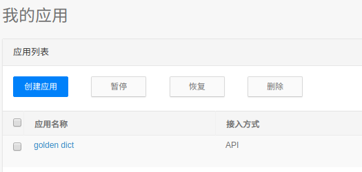
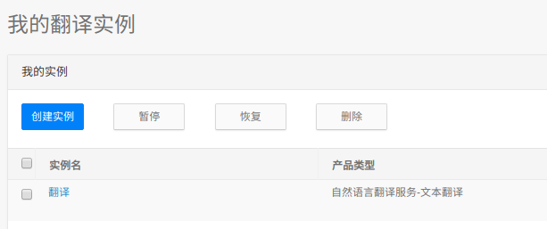

# 给Golden Dict添加一个还算看得过去的有道结果
最近一直在linux的环境里工作，免不了总要查一些单词，于是找到了Golden Dict这个软件，用着也还行。
但是唯一美中不足的就是上面的词典只有英英的，看着有点不习惯。

上网查了一些资料，可以在golden dict里面的编辑->词典->词典来源->网站来配置一个网页查询结果。
但是。。。这个效果真的是惨不忍睹,就等于在这个软件里开了个网页，还显示不全。。。
用的实在是糟心，于是只好自己动手撸了一个能看得过去的。

原理就是因为golden dict这个软件内置了一个webkit作为渲染核心，所以可以轻松渲染html。
所以想让展示结果能看得过去，不如自己动手写一个py脚本，自己定义html要展示什么。

因为要获取有道的结果，此处就需要用到有道的api。虽然有道的api现在不免费了，但是这并不影响我们白嫖他的api（逃

你需要去有道智云去注册一个账号，然后根据引导新建你的应用实例和翻译实例




然后将应用实例里面的应用id和应用密钥填入py脚本相应位置

最后将这条命令填入golden dict的sources->programs,将里面的路径替换为自己的pyTranslation.py文件的路径
```
python3 /your/path/to/pyTranslation.py %GDWORD%
```

然后就可以舒服的使用golden dict看有道的翻译了
